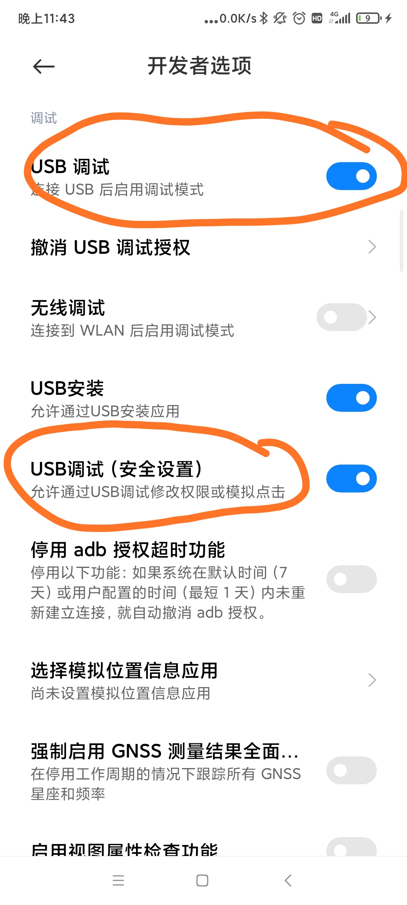

仓库转到[码云](https://gitee.com/youyi_sizruru/AutoCat)去了

## 环境

python 3.0

依赖安装：lxml, click

下载[adb](https://developer.android.com/studio/command-line/adb)并配置到环境变量中

在android手机上开启USB调试和模拟点击.

打开淘宝，打开领猫币界面，运行脚本:

python auto_cat.py -d your_device_name

打开支付宝，打开领猫币界面，运行脚本:

python alipay.py -d your_device_name

## 警告

运行前，最好把一些小游戏先点掉（例如喂小鸡，淘宝人生等等），该脚本无法识别这些。

